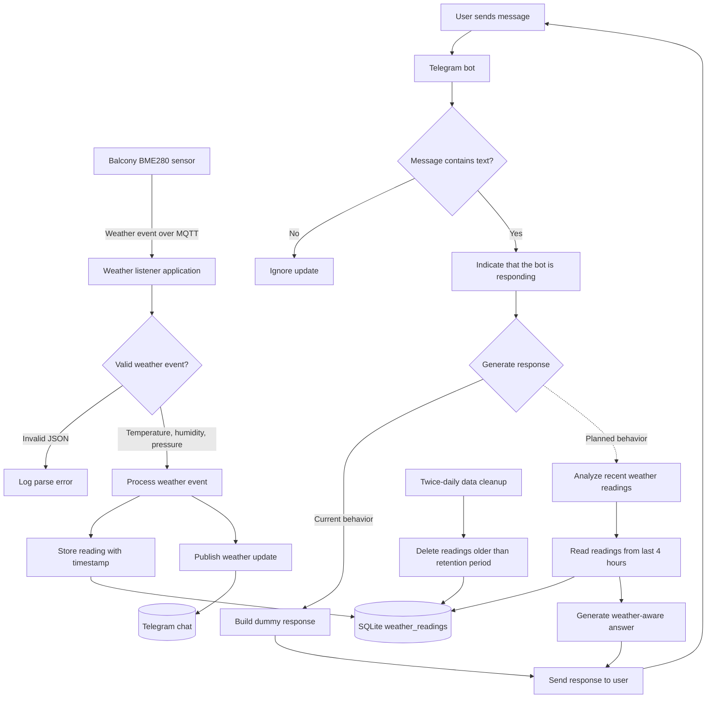

# Message Listener Workflow

This document describes the current runtime workflow of the `message-listener` service.

## Workflow Diagram

## Main Flows

### Sensor readings

1. A balcony BME280 sensor publishes a weather event over MQTT.
2. The application validates the event and extracts temperature, humidity, and pressure.
3. The reading is saved to SQLite with its timestamp.
4. The application formats the event and sends a weather update to the configured Telegram chat.
6. Invalid JSON is logged and produces neither a database row nor a Telegram message.

### Telegram questions

1. The application receives a text message sent to the Telegram bot.
2. It sends a typing indicator while preparing the response.
3. The current implementation returns a dummy response.
4. The intended response path reads the last four hours of readings and generates a weather-aware answer with Vertex AI Gemini.
5. The response is sent back to the user's Telegram chat.

### Data retention

The application runs data cleanup at midnight and noon. It deletes rows older than `cutoff.days` from `weather_readings`; the configured default is three days.

## Runtime Dependencies

- MQTT broker: configured by `mqtt.broker.url`
- SQLite database: configured by `spring.datasource.url`
- Telegram bot token: `TELEGRAM_TOKEN`
- Default Telegram chat: `TELEGRAM_CHAT_ID`
- Vertex AI project: `GCP_PROJECT_ID`
